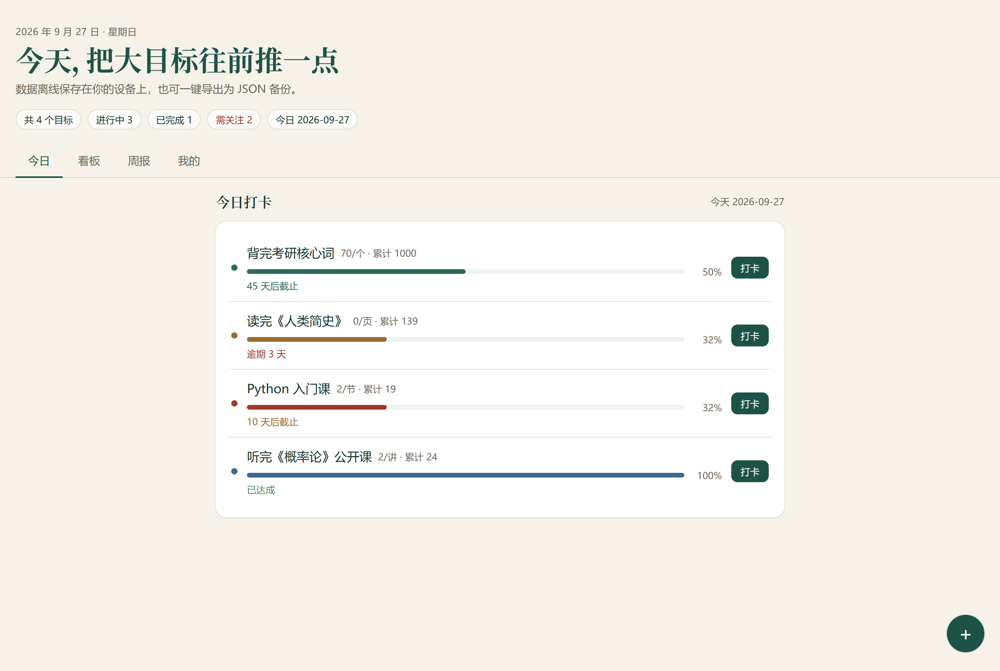
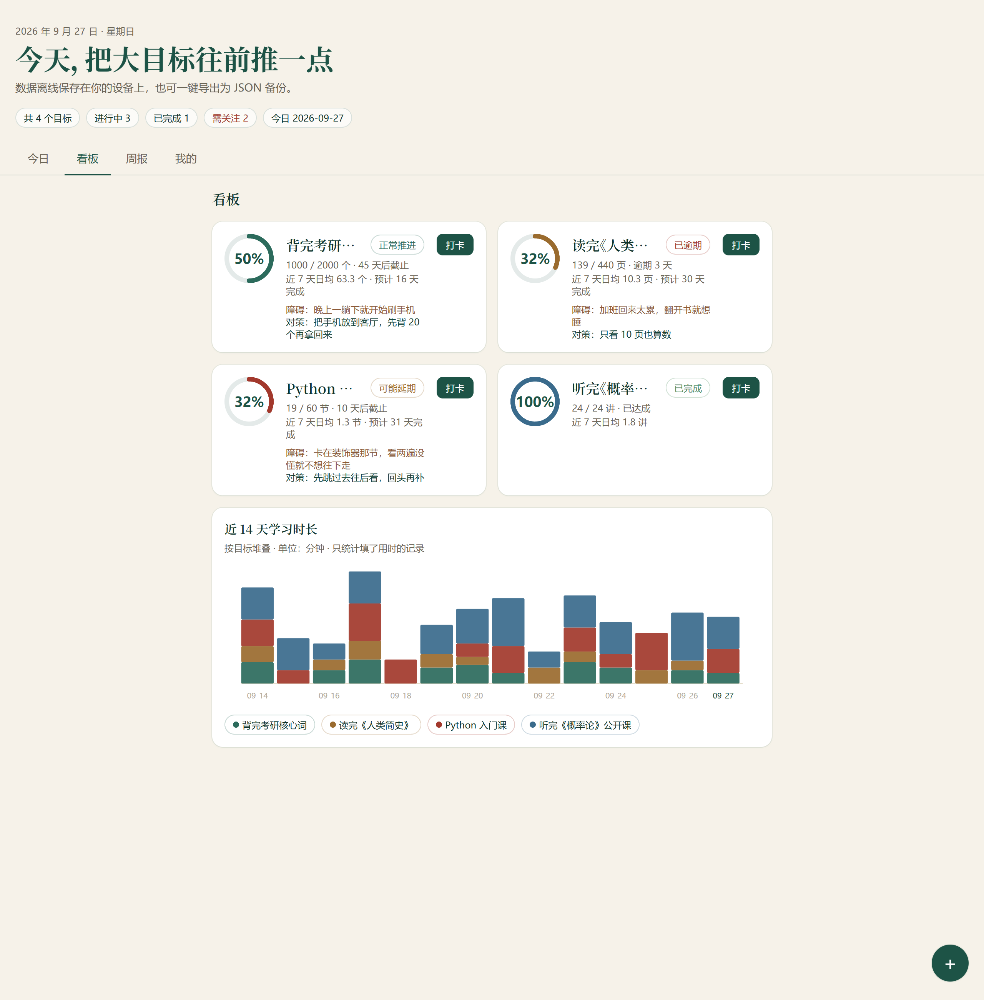
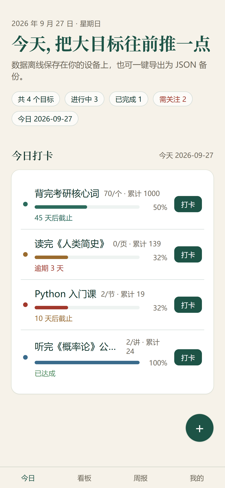
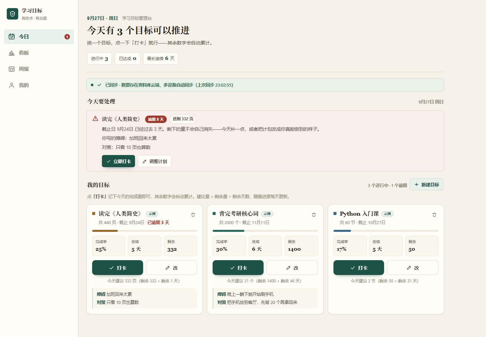

# 学习目标管理台 · Check-in Activity

[](https://github.com/2676136489-png/Check-in-activity/actions/workflows/ci.yml)
[](./LICENSE)


### 👉 [在线演示 · 点开即用（免登录，无需安装）](https://study-goal-console-39820.app.workbuddy.host/)

> 一个「以打卡驱动目标推进」的个人工作台：设定目标 → 每日打卡 → **按近 7 天真实均速推算还剩几天** → 每周四格复盘。

市面上的习惯打卡 App 回答的是「你连续坚持了几天」，这个工具回答的是**「按现在的速度，这本书还要几天读完」**——前者只能让我自我感觉良好，后者才能让我判断今晚要不要多花一小时。整个项目的算法、状态模型和交互都是围绕这一个问题设计的。

仓库里有两套功能对齐、定位不同的实现：**单文件 HTML（零依赖、双击即开）** 与 **React + TypeScript 工程化版（分层架构、可替换数据源）**。上面的演示链接部署的是工程化版。

> 打开后是一张白纸（数据默认存在浏览器本地，不是加载失败），点页面上的「**载入示例数据**」即可看到四组带 14 天记录的目标，覆盖推进中 / 可能延期 / 已逾期 / 已完成四种状态。

---

## 界面

**工程化版 · 今日**（下面的图都是 `build/shots_data.mjs` 与 Playwright 实拍，不是设计稿）



**工程化版 · 看板** —— 环形进度、四态标签、以及手写 SVG 的近 14 天按目标堆叠柱状图（不引图表库）



**移动端** —— 320 / 360 / 390 / 834 / 1440 / 1920 六档视口均无横向溢出，长标题不换行错位



**单文件版 · 今日** —— 另一套实现，零外链零依赖，单个 HTML 文件 2338 行



---

## 目录

- [技术栈](#技术栈)
- [架构](#架构)
- [四个关键设计决策](#四个关键设计决策)
- [工程实践](#工程实践)
- [目录结构](#目录结构)
- [快速开始](#快速开始)
- [部署](#部署)
- [已知限制](#已知限制)

---

## 技术栈

| 层 | 选型 | 说明 |
|---|---|---|
| 视图 | React 18 · TypeScript 5 · Tailwind CSS | 严格模式 TS，无 `any` 逃逸 |
| 构建 | Vite 5 | `base: './'`，可部署到任意子路径 |
| 静态检查 | ESLint 9（flat config）· typescript-eslint | 含 `react-hooks/rules-of-hooks`，拦过真实事故 |
| 测试 | Vitest 2 | 领域层纯函数单测，51 个用例 / 4 个文件 |
| 渲染验证 | react-dom/server + Vite `ssrLoadModule` | 25 项断言，确认页面真的渲染得出来 |
| CI | GitHub Actions | 4 个 job：lint·类型·单测·冒烟·构建 / 产物字节复现 / 页面交互冒烟 / 敏感信息扫描 |
| 存储 | Repository 模式 | IndexedDB（默认，零配置）/ Supabase，适配器可换 |
| 图表 | 手写 SVG | 环形进度与 14 天堆叠柱状图均自行绘制 |

---

## 架构

工程化版的分层，核心是**依赖倒置**——业务层不依赖任何具体存储：

```
┌────────────────────────────────────────────────┐
│                  UI (React)                    │
│      components/ · hooks/useStore.ts           │
└───────────────────┬────────────────────────────┘
                    │  领域类型 + 纯函数
┌───────────────────▼────────────────────────────┐
│            Domain（无副作用、可单测）             │
│   types/  ·  lib/date.ts  ·  lib/eta.ts        │
│           ·  lib/chart.ts  ·  lib/sample.ts    │
│      ← 51 个单测全部落在这一层                    │
└───────────────────┬────────────────────────────┘
                    │  Repository 接口
┌───────────────────▼────────────────────────────┐
│           Data（可替换适配器）                    │
│   repo/types.ts ┌──────────┬──────────┐        │
│                 │IndexedDB │ Supabase │        │
│                 └──────────┴──────────┘        │
└────────────────────────────────────────────────┘
```

换一个数据源只需要改 `createRepo()` 一个工厂函数，业务代码零改动。

---

## 四个关键设计决策

### 1. 领域逻辑必须是纯函数

`lib/` 里放的都是不碰 DOM、不碰存储、不读系统时间的函数。`buildGoalView(goal, logs, today)` 输入目标与打卡记录，输出含 ETA 与状态的视图对象；`stackByGoal(goals, logs, today)` 把记录摊成堆叠柱的分段数据。

这条约束一开始没做到位：`recentDays(7)` 隐式取「真实当天」，导致传入的 `today` 参数只影响状态判定、不影响日均速度，**函数无法被确定性测试**。做测试时暴露出来，改成 `recentDays(7, today)`。同一个毛病后来在图表的 `Chart14d` 里又出现一次（内部自己取 `recentDays(14)`），也改成了可注入。不写测试就不会发现这种缺陷。

### 2. 数据不足时，不编造数字

- 目标没填总量 → 显示「补齐总量后即可估算」，而不是 `0 天`
- 近 7 天没有一条有效打卡 → `etaDays` 返回 `null`，UI 显示「还估不出来」，而不是除以 0 或假装秒完成
- 图表只统计**填了用时**的记录；没填的那几天不按 0 计入，宁可少画一段
- 写远端失败 → 显式报错并保留本地草稿可重试，**不允许静默失败**

「看起来保存成功了其实没存上」是最伤人的一类 bug。所有写操作先落草稿、再写远端，失败有明确出口。

### 3. 状态文案要对得上状态

一个 100% 完成、但截止日已经过去的目标，卡片底下如果还标红写着「逾期 10 天」，读起来像是还有事没做完。完成就是完成。

这条规则被固化成纯函数 `dueLabel(status, dueDays)`：`done` 一律显示「已达成」，其余才走「逾期 N 天 / N 天后截止 / 今天截止」。同时已完成的目标不再显示「预计 0 天完成」——那是 `rest = 0` 的算术结果，对人没有意义。

### 4. 产物必须逐字节可复现

单文件版不是手写的，是由 `build/` 下的三个片段拼出来的：

```bash
cd build && python merge.py      # p1.html + p2.html + final_script.js → ../学习目标管理台.html
```

合成结果与仓库里的 `学习目标管理台.html` **必须逐字节一致**。这不是洁癖——之前真出过一次交付的文件被手工改过、`build/` 里没同步，构建目录里躺着一份和实际运行的不一样的东西。构建脚本一旦复现不了产物，它就从工具变成了摆设。

这条纪律已写进 CI：`artifact-reproducible` job 重新合成一遍，`git diff --exit-code` 不一致就直接红。

---

## 工程实践

### Lint · `npm run lint`

ESLint 9 flat config，开着 `react-hooks/rules-of-hooks`。这条规则不是摆设——它拦住了一个**真实的上线级事故**：

`App.tsx` 里 `if (!repo) return <初始化中/>` 原本写在三个 `useState` **前面**。首屏 `repo` 还是 null，这一轮只跑 3 个 Hook；等 `createRepo()` 解析完，同一轮多跑了 3 个，React 抛 #310（*Rendered more hooks than during the previous render*），**整个应用白屏**。而 `tsc` 和 `vite build` 全程绿灯。这条规则直接指出：「Did you accidentally call a React Hook after an early return?」

### 单元测试 · `npm test` → **51 个用例 / 4 个文件全绿**

覆盖的是容易错、且错了不容易发现的地方：

| 文件 | 用例 | 覆盖重点 |
|---|---|---|
| `eta.test.ts` | 14 | 休息日不计日均但计入累计；`avg7 = 0` 时 `etaDays` 返回 `null`；四态判定优先级；`dueLabel` 的已完成分支；周去重按周一 |
| `sample.test.ts` | 16 | 示例数据的确定性、日期全部落在 14 天窗口内、引用完整性、**四种状态全覆盖** |
| `chart.test.ts` | 11 | 堆叠偏移连续、总量等于各段之和、缺目标不抬高 offset、没填用时的记录不计入 |
| `date.test.ts` | 10 | 闰年 `2028-02-28 → 02-29 → 03-01`、跨月跨年、周日归本周一、`recentDays` 含基准当天 |

> **两个踩过的坑，都值得记一笔。**
>
> 一是 Vitest 默认的文件级并行，在某些沙箱环境里会因为 worker 写模块缓存被拦（`EPERM`）而**静默跳过第二个测试文件却仍然报绿**——只跑了一个文件还说通过，是最危险的假阳性。用 `test.fileParallelism: false` 解决，原因写在 `vitest.config.ts` 注释里。
>
> 二是 `build/shots.mjs` / `shots_data.mjs` 用 `new URL(import.meta.url).pathname` 取脚本目录，而它对中文路径返回 percent-encoded 形式，Windows 会把它当成一个**真实存在的目录名**。后果极其隐蔽：读页面走 `file://` URL（Chrome 会解码 → 加载正确文件），写截图走那个未解码的路径（→ 全部落进一个幽灵目录）。于是「截图看着有内容，其实是几小时前的旧图」，页面改了也完全看不出来。改用 `fileURLToPath` 修好。

### 渲染冒烟 · `npm run smoke` → **25 项断言**

`tsc` 和 `vite build` 都不跑渲染，所以上面那个白屏事故它们一无所知。这个脚本用 `react-dom/server` 把 App 和四个页签、空态、页头各渲染一次，断言内容正确：四态标签齐不齐、图表柱子是不是真的按目标分色（而不只是图例分色）、已完成的目标有没有误报逾期。

已知边界写清楚了：SSR 不执行 `useEffect`，所以只能验证**首屏渲染不抛错 + 内容正确**，交互与 IndexedDB 落盘另行在浏览器里确认。

### 单文件版验证

```bash
node build/smoke.mjs        # jsdom 造桩数据把页面真跑起来，9 组交互断言（46 条 / 0 失败）
node build/shots.mjs        # Playwright 六档尺寸实拍 + 横向溢出元素扫描
```

### CI · [`.github/workflows/ci.yml`](./.github/workflows/ci.yml)

| Job | 内容 |
|---|---|
| `app` | `npm ci` → `lint` → `typecheck` → `test` → `smoke` → `build`（Node 20） |
| `artifact-reproducible` | 重新合成单文件版 → `git diff --exit-code` 断言字节一致 |
| `single-file-smoke` | 单文件版的 jsdom 交互冒烟 |
| `secret-scan` | 扫描 `sk-` / `ghp_` / `AKIA` / 私钥头等特征，命中即红 |

> `secret-scan` 的模式拆成数组再拼接，因为直接写成一条长正则的话，**规则文本本身会命中规则**——第一次跑就自报了一次，属于经典的扫描器自命中。

### 其他约定

- **敏感信息绝不入库**：密钥、令牌一律走环境变量；`.gitignore` 覆盖 `.env*` / `*.key` / `*.pem` / `credentials.json`
- **LF 强制**：`.gitattributes` 全仓归一化换行，否则字节级比对会被 `core.autocrlf` 误判

---

## 目录结构

```
.
├── 学习目标管理台.html          # 单文件运行版（构建产物，2338 行 / 零外链零依赖）
├── app/                        # 工程化版（React 18 + TS + Vite，26 个源文件 ≈ 1830 行）
│   ├── src/
│   │   ├── types/              # 领域类型
│   │   ├── lib/                # 纯函数 + 单测（date / eta / chart / sample / palette）
│   │   ├── repo/               # Repository 接口 + IndexedDB / Supabase 适配器
│   │   ├── hooks/              # useStore（状态集中）
│   │   └── components/         # UI（含 EmptyState 空态引导）
│   ├── scripts/smoke-render.mjs  # SSR 渲染冒烟
│   ├── public/favicon.svg      # 与设计系统同源的进度环图标
│   ├── eslint.config.js
│   └── vitest.config.ts        # fileParallelism: false（原因见注释）
├── build/                      # 单文件版的构建与验证工具链
│   ├── p1.html  p2.html        #   源片段：CSS / 骨架
│   ├── final_script.js         #   源片段：逻辑
│   ├── merge.py                #   合成 → ../学习目标管理台.html（逐字节可复现）
│   ├── smoke.mjs  shots.mjs    #   验证：交互断言 / 多尺寸实拍
│   └── seed.py                 #   示例数据种子（幂等，支持 --dry-run）
├── docs/                       # README 用的实拍图
├── .github/workflows/ci.yml    # CI（4 个 job）
├── 项目介绍.md                  # 设计取舍与来龙去脉
└── LICENSE                     # MIT
```

> `build/` 里另有十余个一次性排障脚本（`dbg*` / `fix_*` / `unmangle*`），是逐段修 bug 时留下的痕迹，不参与构建。其中 `check.js` 与 `build_script.py` 属于 v1 遗留的上一级管线，**已经断了，不要跑**（原因见 [`项目介绍.md`](./项目介绍.md)）。

---

## 快速开始

**工程化版**

```bash
cd app
npm install
npm run dev          # http://localhost:5173
npm run lint         # ESLint
npm test             # 51 个单测
npm run smoke        # 25 项渲染冒烟
npm run typecheck    # 仅类型检查
npm run build        # 产物在 app/dist/
```

首次打开是空态——数据默认存在浏览器本地，所以是一张白纸，不是加载失败。页面上点「**载入示例数据**」即可看到四组带 14 天记录的目标（同时覆盖推进中 / 可能延期 / 已逾期 / 已完成四种状态），随时可在「我的」里一键清除。

**单文件版**：直接用浏览器打开 `学习目标管理台.html` 即可。它通过云端数据表读写数据，离线打开会走降级路径——UI 正常渲染、空态有提示，**不会白屏**。

**重新构建单文件版**

```bash
cd build && python merge.py
git diff --exit-code -- ../学习目标管理台.html   # 应无输出
```

---

## 部署

**当前线上**：<https://study-goal-console-39820.app.workbuddy.host/>

**工程化版**

```bash
cd app && npm run build
```

`dist/` 是纯静态产物，可直接丢到任意静态托管。已配置 `base: './'`，因此放在**子路径**下也不会出现资源 404 白屏。

**GitHub Pages**：仓库里已经放好了 `.github/workflows/pages.yml`，推到 `main` 就会构建并发布 `app/dist`。需要在仓库 **Settings → Pages → Build and deployment → Source** 里选择 **GitHub Actions**（一次性设置），之后地址是 `https://2676136489-png.github.io/Check-in-activity/`。工作流里带了一条断言：产物不得出现 `src="/..."` 这种绝对路径引用，出现即失败——防止哪天误改 `base` 又变成白屏。

**Vercel**：Framework 选 Vite，Build Command `npm run build`，Output Directory `dist`，Root Directory `app`。

**单文件版**：把 `学习目标管理台.html` 放到任意静态托管即可。

---

## 已知限制

写在这里，是因为它们我都知道、但这次没做：

- **开发工具链有 5 条中低危依赖公告**（`vite` / `esbuild` / `@vitest/mocker`）。生产依赖 `npm audit --omit=dev` 为 **0 漏洞**；这些只影响本地开发服务器与测试环境，不影响构建产物与线上运行。修掉需要升 Vite 到 7+ / Vitest 到 5，属于破坏性升级，这次没动。
- **测试只覆盖领域层**。组件层没有单测，靠 SSR 渲染冒烟 + 浏览器实测兜底。要往上做需要引 `@testing-library/react` + jsdom。
- **`app/` 与单文件版不共享数据**。工程化版默认走 IndexedDB，想打通得补一个走 `__SMART_PAGE__.database` 的适配器。
- **`check.js` → `final_script.js` 这一级上游构建是断的**（原因见 `项目介绍.md`）。要么把 `check.js` 更新到 v2 接回来，要么承认 `final_script.js` 就是源。
- **`build/` 里堆了十余个排障脚本**，该归档到 `build/legacy/` 或清掉。
- **GitHub Pages 的演示页还没生效**：工作流已经写好，但需要去仓库 Settings → Pages 把 Source 改成 GitHub Actions 才会跑。在那之前线上入口只有上面 WorkBuddy 那条链接。

---

## 项目文档

- [`项目介绍.md`](./项目介绍.md) —— 为什么做、怎么做的、哪些地方较过真、哪些还没做
- [`app/README.md`](./app/README.md) —— 工程化版的架构说明、测试与 Supabase 接入步骤
- [`LICENSE`](./LICENSE) —— MIT
